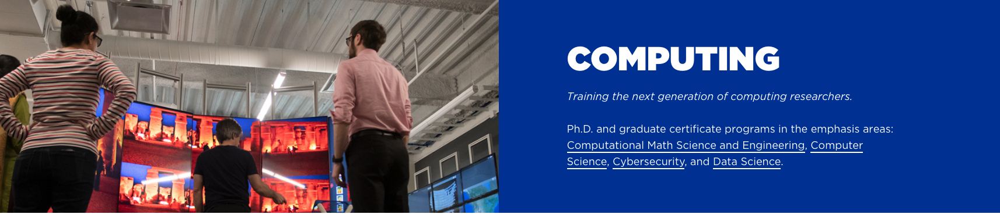

<html>
<head>
<meta name="viewport" content="width=device-width, initial-scale=1">

</head>
<body>

 For the 2020-2021 academic year I am on sabbatical. 

My current research is in computational inverse methods mainly applied to problems in the Geosciences, but also to more general imaging, signal processing and machine learning problems.  

       
          

          

      
  
      <figcaption>Mathematics Building at Boise State</figcaption> 

          

          

  
   <figcaption>https://boisestate.edu/computing</figcaption>

  
  <figcaption>Domenzain et al, Geophysics, 2020 </figcaption>

  
 
<figcaption>Mead, Inv. Prob. Imag., 2020 </figcaption> 

 
 <figcaption>Hetrick, Inv. Prob. Sci. Eng., 2018</figcaption>

 <figcaption>Treasure valley sunset</figcaption>

 <figcaption>Mountain biking in Sawtooths</figcaption>

 <figcaption>Snowboarding in Wasatch</figcaption>

 <figcaption>Melanie</figcaption>

<a class="prev" onclick="plusSlides(-1)">&#10094;</a>
<a class="next" onclick="plusSlides(1)">&#10095;</a>

 

  
  
  
  
  
  
  
  
  
  

</body>
</html>
 
